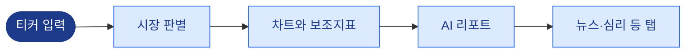
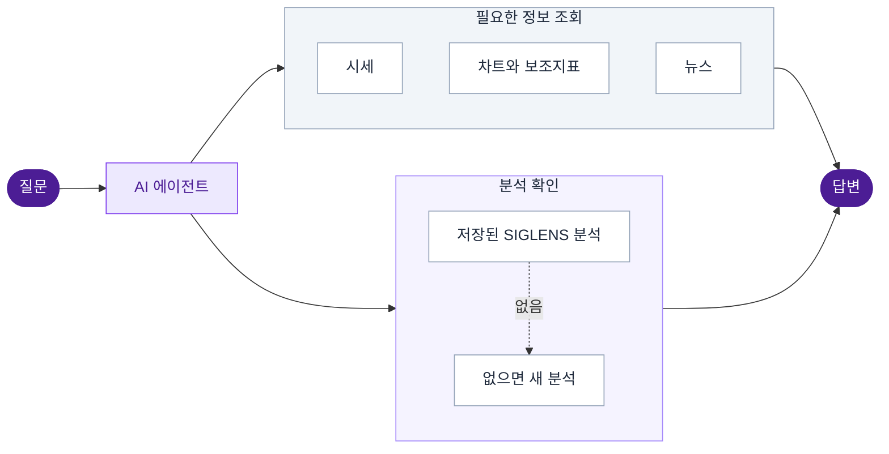
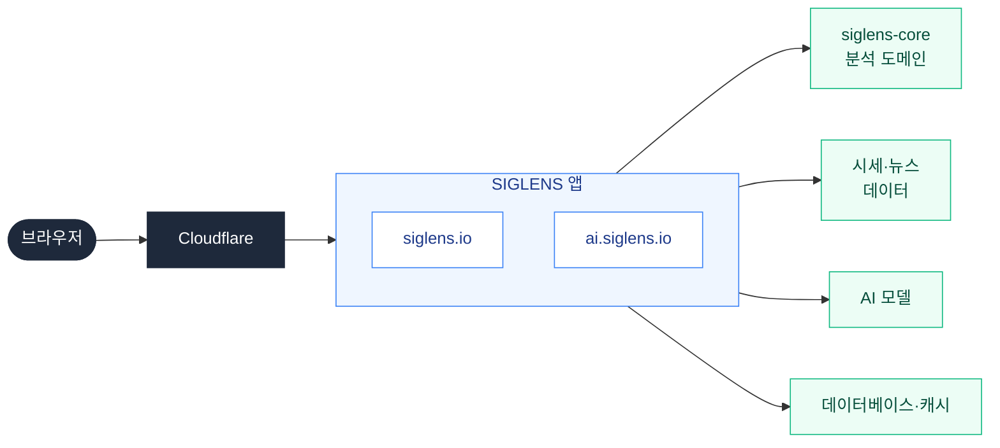

# SIGLENS

<div align="center">

**보조지표를 읽는 수고 대신, 차트의 흐름을 읽는다. 미국 주식·한국 주식·암호화폐를 위한 AI 분석.**

[](https://github.com/y0ngha/siglens/releases)
[](./LICENSE)

[](https://siglens.io)
[](https://ai.siglens.io)
[](./README.md)

</div>

---

## SIGLENS가 하는 일

차트를 제대로 읽는 일은 생각보다 손이 많이 간다. 보조지표를 하나씩 올리고, 거래량을 확인하고, 패턴을 찾고, 뉴스까지 훑은 뒤에야 전체를 종합해 판단할 수 있다. 대부분은 그 과정의 중간쯤에서 멈춘다.

SIGLENS는 그 해석을 대신한다. 시세, 보조지표, 패턴, 뉴스, 시장 심리를 한데 모아 읽기 쉬운 문장의 리포트로 정리한다. 종목 하나를 열어 분석을 읽을 수도 있고, 궁금한 것을 질문으로 던져 답을 받을 수도 있다.

SIGLENS는 주문을 넣지 않는다. 분석만 제공하며, 투자 판단은 언제나 읽는 사람의 몫이다. 회원가입 없이도 바로 사용할 수 있고, 로그인하면 아래에 소개하는 몇 가지 기능이 더해진다.

## 사용 방법

### siglens.io: 종목별 분석

`AAPL`, `005930.KS`, `BTCUSD` 같은 티커를 입력하면 보조지표가 얹힌 차트와 감지된 패턴, 그리고 실시간으로 작성되는 AI 리포트가 나타난다. 차트 옆 탭에서는 뉴스, 공포·탐욕 지수, 종합 전망을 볼 수 있다. 주식은 펀더멘털과 재무제표를, 미국 주식은 옵션 시장과 의회 거래 동향을 추가로 제공한다.

개별 종목 외에도 섹터 신호 대시보드, 시장 공포·탐욕 지수, 뉴스 허브, 거시경제 대시보드, 과거 AI 분석의 백테스팅 결과를 볼 수 있다.



### ai.siglens.io: 질문으로 묻기

"비트코인 요즘 흐름 어때?"처럼 평소 말투로 물으면 된다. AI 에이전트가 필요한 정보를 스스로 판단해 시세, 차트, 기존 SIGLENS 분석, 최근 뉴스를 조회하고, 찾은 수치를 근거로 답한다. 최근 분석이 없으면 새로 분석을 실행한다. 에이전트가 거친 단계와 걸린 시간은 답변 위에 함께 표시된다.

비회원은 하루에 질문할 수 있는 횟수가 정해져 있다. 로그인하면 횟수 제한이 없어지고, 대화가 저장되며, 등록한 보유 종목을 바탕으로 답을 받을 수 있다.



## 지원 시장

모든 종목은 하나의 시장에 속하며, 시장에 따라 통화, 거래 시간, 사용할 수 있는 시간 단위, 보이는 탭이 정해진다.

| | 미국 주식 | 한국 주식 | 암호화폐 |
|---|---|---|---|
| 예시 | `AAPL` | `005930.KS`, `247540.KQ` | `BTCUSD` |
| 통화 | 달러 | 원 | 달러 |
| 거래 시간 | NYSE·NASDAQ | KRX | 24시간 |
| 시세 | 실시간 | 20분 지연 | 실시간 |
| 펀더멘털·재무제표 | 제공 | 제공 | 미제공 |
| 옵션·의회 거래 | 제공 | 미제공 | 미제공 |

## 버전

현재 버전은 상단 배지에 표시된다. 릴리스별 변경 사항은 [Releases](https://github.com/y0ngha/siglens/releases) 페이지에서 확인할 수 있다.

## 개발자를 위한 안내

### 구성



두 사이트는 하나의 애플리케이션이 제공하며, 접속한 호스트 이름에 따라 보여 줄 화면을 고른다. 보조지표 계산, 패턴 감지, 신호 판단, 프롬프트 구성은 분석 도메인을 담은 별도 패키지 `@y0ngha/siglens-core`에 있다. 분석 기법은 `skills/` 아래의 Markdown 파일로 작성하기 때문에, 계산 코드를 건드리지 않고도 새 기법을 추가할 수 있다.

### 로컬에서 실행하기

```bash
git clone https://github.com/y0ngha/siglens.git
cd siglens
yarn install
cp .env.example .env.local
yarn dev
```

앱은 `http://localhost:4200`에서 실행된다. Node.js는 `.nvmrc`의 버전을 사용하고, Yarn 버전은 `package.json`에 고정되어 있다. `@y0ngha/siglens-core`가 GitHub Packages에 배포되어 있어 의존성을 설치하려면 GitHub 토큰이 필요하다. 환경변수는 `.env.example`과 [API.md](./docs/reference/API.md)에, 스크립트는 `package.json`에 모두 정리되어 있다.

### 문서

프로젝트 문서는 한국어로 작성되어 있으며, 전체 목록은 [docs/README.md](./docs/README.md)에 있다. 처음 읽기에 좋은 문서는 다음과 같다.

| 문서 | 내용 |
|---|---|
| [SERVICE.md](./docs/product/SERVICE.md) | 서비스가 하는 일과 대상 사용자 |
| [ARCHITECTURE.md](./docs/architecture/ARCHITECTURE.md) | 레이어 구조와 의존 규칙 |
| [SCOPE.md](./docs/architecture/SCOPE.md) | 이 저장소와 siglens-core의 역할 구분 |
| [DOMAIN.md](./docs/product/DOMAIN.md) | 보조지표, 패턴, 비즈니스 규칙 |
| [CONVENTIONS.md](./docs/conventions/CONVENTIONS.md) | 코딩과 테스트 규칙 |
| [DEPLOY_RUNBOOK.md](./docs/architecture/DEPLOY_RUNBOOK.md) | 배포, 롤백, 장애 대응 |

## 보안

취약점은 공개 이슈로 올리지 말고 [SECURITY.md](./SECURITY.md)의 절차를 따라 제보해 주기 바란다.

## 기여

아직 외부 코드 기여는 받지 않는다. 버그 제보와 제안은 [Issues](https://github.com/y0ngha/siglens/issues)에서 받는다.

## 라이선스

[MIT License](./LICENSE)
