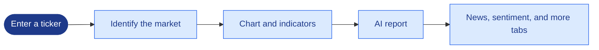
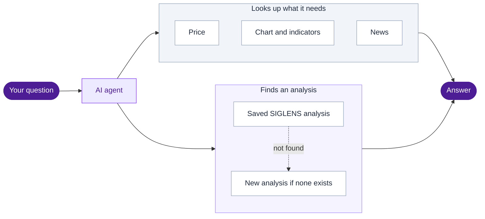
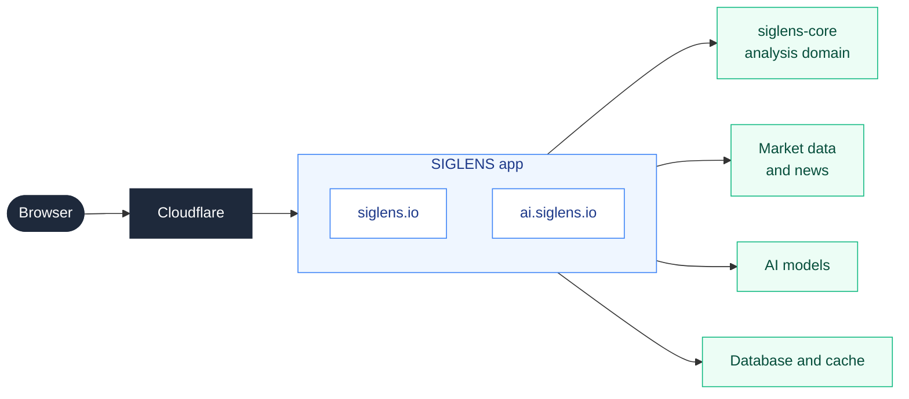

# SIGLENS

<div align="center">

**Read the chart, not the indicators. AI analysis for US stocks, Korean stocks, and crypto.**

[](https://github.com/y0ngha/siglens/releases)
[](./LICENSE)

[](https://siglens.io)
[](https://ai.siglens.io)
[](./README.ko.md)

</div>

---

## Why SIGLENS

Reading a chart well takes more work than it looks. You add indicators one by one, check volume, look for patterns, skim the news, and then try to weigh all of it together. Most people stop halfway.

SIGLENS does that reading for you. It gathers price data, indicators, patterns, news, and market sentiment, and turns them into a report written in plain language. You can open a single symbol and read its analysis, or simply ask a question and get an answer.

SIGLENS never places an order. It offers analysis only, and every investment decision remains your own. Everything works without an account.

## Two ways to use it

### siglens.io: analysis by symbol

Enter a ticker such as `AAPL`, `005930.KS`, or `BTCUSD`. The page shows a chart with indicators, detected patterns, and an AI report that streams in as it is written. Tabs next to the chart cover news, the fear and greed index, and a combined outlook. Stocks add fundamentals and financial statements, and US stocks add the options market and congressional trading.

Beyond single symbols, the site offers a sector signal dashboard, a market-wide fear and greed index, a news hub, a macroeconomic dashboard, and backtesting results for past AI analyses.



### ai.siglens.io: ask in your own words

Ask something like "How has Bitcoin been moving lately?" The AI agent decides what it needs, looks up the price, chart, existing SIGLENS analysis, and recent news, and then answers with the numbers it found. When no recent analysis exists, it runs a new one. Every step it takes is shown above the answer, along with how long it took.

Guests can ask a limited number of questions each day. Signing in removes that limit, saves your conversations, and lets the agent look at the holdings you registered.



## Supported markets

Each symbol belongs to one market, and the market decides the currency, trading hours, available timeframes, and which tabs appear.

| | US stocks | Korean stocks | Crypto |
|---|---|---|---|
| Example | `AAPL` | `005930.KS`, `247540.KQ` | `BTCUSD` |
| Currency | USD | KRW | USD |
| Trading hours | NYSE and NASDAQ | KRX | Around the clock |
| Quotes | Real time | 20-minute delay | Real time |
| Fundamentals and statements | Yes | Yes | No |
| Options and congressional trading | Yes | No | No |

## Version

The current version is shown in the badge at the top. Changes for each release are listed on the [Releases](https://github.com/y0ngha/siglens/releases) page.

## For developers

### How it fits together



Both sites are served by the same application, which chooses what to render from the host name. Indicator math, pattern detection, signal logic, and prompt building live in `@y0ngha/siglens-core`, a separate package that holds the analysis domain. Analysis techniques are written as Markdown files under `skills/`, so a new technique can be added without touching calculation code.

### Running locally

```bash
git clone https://github.com/y0ngha/siglens.git
cd siglens
yarn install
cp .env.example .env.local
yarn dev
```

The app starts at `http://localhost:4200`. Installing dependencies requires a GitHub token because `@y0ngha/siglens-core` is published to GitHub Packages. Every environment variable is explained in `.env.example` and [API.md](./docs/reference/API.md), and every script is listed in `package.json`.

### Documentation

Project documentation is written in Korean. [docs/README.md](./docs/README.md) indexes all of it. These are good places to start:

| Document | Contents |
|---|---|
| [SERVICE.md](./docs/product/SERVICE.md) | What the service does and who it is for |
| [ARCHITECTURE.md](./docs/architecture/ARCHITECTURE.md) | Layer structure and dependency rules |
| [SCOPE.md](./docs/architecture/SCOPE.md) | What belongs in this repository and what belongs in siglens-core |
| [DOMAIN.md](./docs/product/DOMAIN.md) | Indicators, patterns, and business rules |
| [CONVENTIONS.md](./docs/conventions/CONVENTIONS.md) | Coding and testing conventions |
| [DEPLOY_RUNBOOK.md](./docs/architecture/DEPLOY_RUNBOOK.md) | Deployment, rollback, and incident response |

## Security

Please do not report a vulnerability in a public issue. Follow the process in [SECURITY.md](./SECURITY.md).

## Contributing

The project does not accept outside code contributions yet. Bug reports and suggestions are welcome in [Issues](https://github.com/y0ngha/siglens/issues).

## License

[MIT License](./LICENSE)
